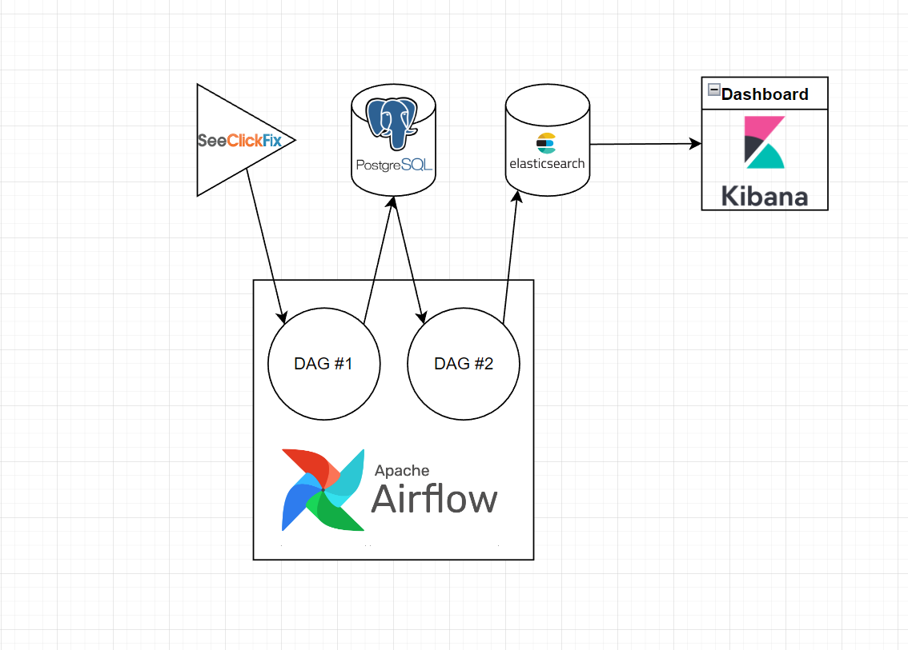

# SeeClickFix API data updated daily for realt-time dashboard

### Languages used: 
Python

### Other tools used: 
Apache Airflow, Elasticsearch + Kibana, Postgresql, PGAdmin4, Linux, Docker

### Setup:
For my setup, I installed linux on two mini PC's and used a rasberrypie(I had to go and get another pc because elasticsearch takes up alot of computing power)

 - PC1: intel i7 6 cores, 8Gb RAM:
    Dockerized Apache Airflow and PGAdmin4
 
 - PC2: intel i5 4 cores, 16Gb RAM:
    Dockeredized Elasticsearch and Kibana

 - Raspberrypi4: 4Gb RAM:
    Dockerized postgresql

I wanted to use the raspberrypi4 to simulate multiple instances environment.
The actual setting up of the environment took up 70% the time of this project. I decided to go with Docker because allowed me to set up clean environments that can be spun up/down anytime

### Flowchart:

In this project, I used the ETL method to extract daily data from Seelickfix api, transform them before loading it into postgreSQL for storage, before transferring them again to elastic search, where a dash board can be created with Kibana

 - Extract: Call SeeClickFix api for civil complaints in the county of Santa Clara, California

 - Transform:
    + Normalize date data: split datetime data into date and time. New column for date only (the api gives the same time stamp)
    + Extract zip code: rename address column and create a new column for zip code
    + Coordinate: convert long/lat data into geohash
    + Final columns: 'id','summary','description','rating','full_address','html_url','date','time','zip_code','coordinate'

 - Load:
    + 